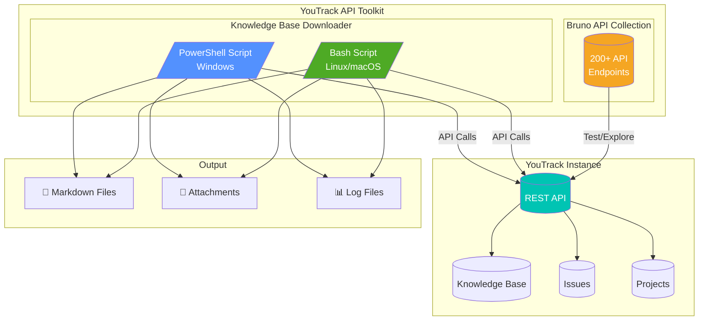
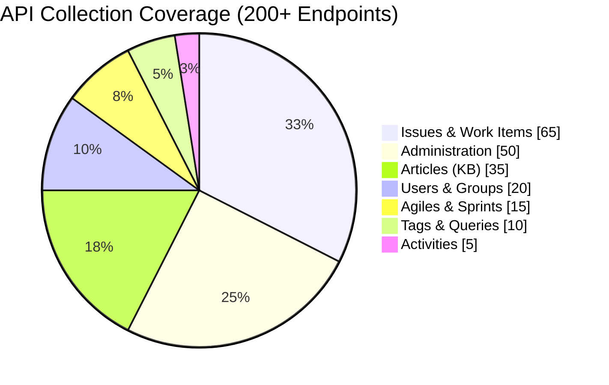
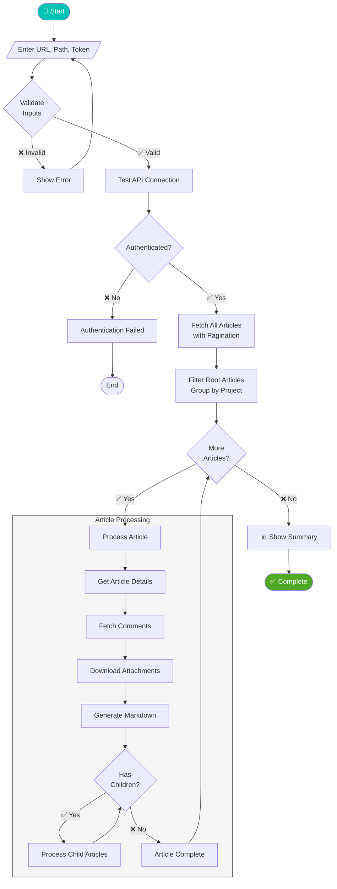
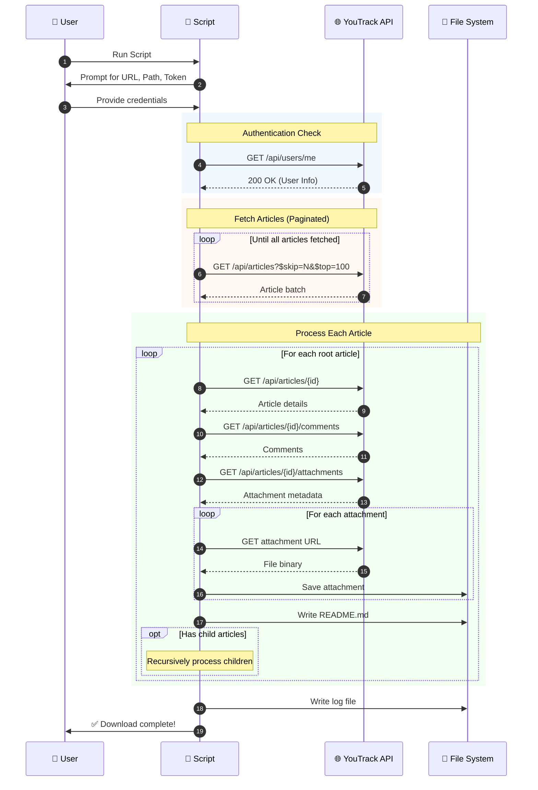
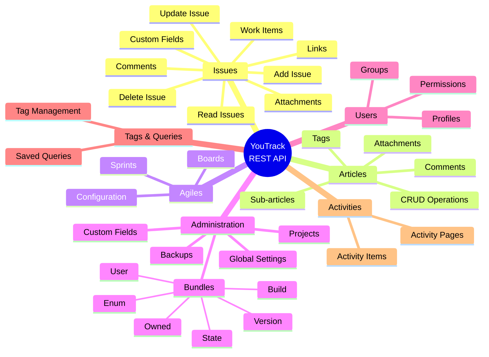

<p align="center">
  
</p>

<h1 align="center">🚀 YouTrack API Toolkit</h1>

<p align="center">
  <strong>A comprehensive toolkit for working with JetBrains YouTrack</strong>
</p>

<p align="center">
  <a href="#-features">Features</a> •
  <a href="#-installation">Installation</a> •
  <a href="#-knowledge-base-downloader">KB Downloader</a> •
  <a href="#-bruno-api-collection">API Collection</a> •
  <a href="#-license">License</a>
</p>

<p align="center">
  
  
  
  
</p>

---

## 🏗️ Architecture Overview



---

## ✨ Features

### 📥 Knowledge Base Downloader

Export your entire YouTrack Knowledge Base with a single command!

- 🗂️ **Full Hierarchy Export** — Preserves article structure with parent/child relationships
- 💬 **Comments Included** — All article comments embedded in markdown files
- 📎 **Attachments Download** — Automatically downloads all file attachments
- 📝 **Markdown Output** — Clean, readable markdown files with metadata tables
- 📊 **Detailed Logging** — Color-coded console output + log files
- 🔄 **Pagination Support** — Handles large knowledge bases efficiently
- 🖥️ **Cross-Platform** — PowerShell (Windows) & Bash (Linux/macOS) versions

### 🔌 Bruno API Collection

A complete API collection for exploring and testing YouTrack's REST API using [Bruno](https://www.usebruno.com/).

**Covered Endpoints:**

| Category | Operations |
|----------|------------|
| 📋 **Issues** | CRUD, Links, Comments, Attachments, Work Items, Custom Fields |
| 📚 **Articles** | Knowledge Base management, Sub-articles, Tags |
| 🏃 **Agiles** | Boards, Sprints, Configuration |
| 👥 **Users & Groups** | User management, Profiles, Permissions |
| ⚙️ **Administration** | Projects, Custom Fields, Bundles, Backups |
| 🏷️ **Tags & Queries** | Saved searches, Tag management |
| 📊 **Activities** | Activity streams, Change tracking |



---

## 📦 Installation

### Knowledge Base Downloader

**Prerequisites:**
- **PowerShell 5.1+** (Windows) or **Bash** (Linux/macOS)
- **curl** and **jq** (for Bash version)
- A YouTrack **Permanent Token** ([How to get one](https://www.jetbrains.com/help/youtrack/cloud/Manage-Permanent-Token.html))

```bash
# Clone the repository
git clone https://github.com/yourusername/youtrack-api-toolkit.git
cd youtrack-api-toolkit
```

### Bruno API Collection

1. Install [Bruno](https://www.usebruno.com/) (free, open-source API client)
2. Open Bruno and select **"Open Collection"**
3. Navigate to the `YouTrack REST API` folder
4. Configure your environment variables

---

## 📥 Knowledge Base Downloader

### Windows (PowerShell)

```powershell
.\Download-YouTrackKnowledgeBase.ps1
```

### Linux/macOS (Bash)

```bash
chmod +x download-youtrack-knowledgebase.sh
./download-youtrack-knowledgebase.sh
```

### Interactive Prompts

The script will ask for:

1. **YouTrack Base URL** — e.g., `https://youtrack.example.com`
2. **Output Path** — Where to save the export
3. **Permanent Token** — Your API authentication token

### Download Process Flow



### Output Structure

```
📁 YouTrack-Export/
├── 📁 PROJECT-A/
│   ├── 📁 KB-1/
│   │   ├── 📄 README.md
│   │   ├── 📁 attachments/
│   │   │   └── 📎 image.png
│   │   └── 📁 KB-2/
│   │       └── 📄 README.md
│   └── 📁 KB-3/
│       └── 📄 README.md
├── 📁 PROJECT-B/
│   └── ...
└── 📄 download_2024-01-15_10-30-00.log
```

### Example Output (Markdown)

```markdown
# Getting Started with Our Platform

## Metadata

| Property | Value |
|----------|-------|
| **ID** | KB-42 |
| **Project** | DOCS |
| **Author** | John Doe |
| **Created** | 2024-01-15 10:30:00 |
| **Updated** | 2024-01-20 14:45:00 |

## Content

Welcome to our platform! This guide will help you...

## Attachments

- **screenshot.png** (125.5 KB)
  - Author: Jane Smith
  - File: [attachments/screenshot.png](attachments/screenshot.png)

## Comments

### Comment 1 - Alice (2024-01-16 09:00:00)

Great article! Very helpful.

---
```

---

## 🔌 Bruno API Collection

### API Interaction Flow



### Setup

1. Open the collection in Bruno
2. Go to **Environments** → Create a new environment
3. Add these variables:

| Variable | Description | Example |
|----------|-------------|---------|
| `baseUrl` | Your YouTrack instance URL | `https://youtrack.example.com` |
| `token` | Your permanent token | `perm:xxx.xxx.xxx` |

### Quick Start Examples

#### Get All Issues

```
GET {{baseUrl}}/api/issues?fields=id,summary,project(shortName)
Authorization: Bearer {{token}}
```

#### Create an Article

```
POST {{baseUrl}}/api/articles
Authorization: Bearer {{token}}
Content-Type: application/json

{
  "summary": "New Article",
  "content": "Article content here...",
  "project": { "id": "0-0" }
}
```

### Collection Structure



#### Folder Overview

```
📁 YouTrack REST API/
├── 📁 Issues/
│   ├── 📄 Add a New Issue.bru
│   ├── 📄 Read a List of Issues.bru
│   └── 📁 Operations with Specific Issue/
├── 📁 Articles/
│   └── ...
├── 📁 Administration/
│   ├── 📁 Projects/
│   ├── 📁 Custom Field Settings/
│   └── 📁 Global Settings/
└── ...
```

---

## 🔐 Authentication

Both tools use YouTrack's **Permanent Token** authentication.

### Getting a Permanent Token

1. Log into your YouTrack instance
2. Go to **Profile** → **Account Security** → **Tokens**
3. Click **"New token..."**
4. Give it a name and select required scopes
5. Copy the token (you won't see it again!)

### Token Format

```
perm:username.tokenname.secretpart
```

---

## 🛠️ Requirements

### Knowledge Base Downloader

| Platform | Requirements |
|----------|--------------|
| Windows | PowerShell 5.1+ |
| Linux | Bash, curl, jq |
| macOS | Bash, curl, jq |

**Install jq (if needed):**

```bash
# Ubuntu/Debian
sudo apt-get install jq

# macOS
brew install jq

# Fedora
sudo dnf install jq
```

### Bruno Collection

- [Bruno](https://www.usebruno.com/) v1.0+

---

## 📄 License

This project is licensed under the **MIT License** — see the [LICENSE](LICENSE) file for details.

---

## 🤝 Contributing

Contributions are welcome! Feel free to:

- 🐛 Report bugs
- 💡 Suggest features
- 🔧 Submit pull requests

---

## 📬 Support

If you find this project helpful, consider giving it a ⭐ on GitHub!

---

<p align="center">
  <sub>Made with ☕ and 💻 by <a href="https://github.com/yourusername">Viorel Ghiurca</a></sub>
</p>

